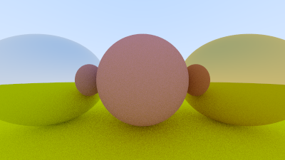
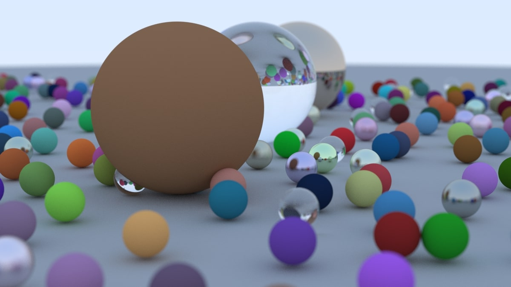

# Ray Tracing in One Weekend

This project is an implementation of the "Ray Tracing in One Weekend" book by Peter Shirley. The purpose of this project is to provide a simple yet educational example of ray tracing in computer graphics.

## Table of Contents
- [About](#about)
- [Features](#features)
- [Examples](#examples)
- [Reference](#reference)

## About

The "Ray Tracing in One Weekend" project is a series of books written by Peter Shirley that teaches the fundamentals of ray tracing. This repository contains a practical implementation of the concepts presented in the book, allowing you to explore the world of computer graphics through ray tracing.

## Features

- **Ray Tracing Basics**: Implement basic ray tracing techniques as described in the book.
- **Positionable Camera**: Extend the basic implementation to include a positionable camera, allowing for more dynamic scenes.
- **Modular Design**: Code is organized into modular components, making it easy to understand and extend.
- **Educational**: Well-commented code and straightforward implementation to aid learning.

## Examples

Examples of the rendered images produced by the ray tracer.

    

    

    

    

    

    

    

    

## Reference

[_Ray Tracing in One Weekend_](https://raytracing.github.io/books/RayTracingInOneWeekend.html)